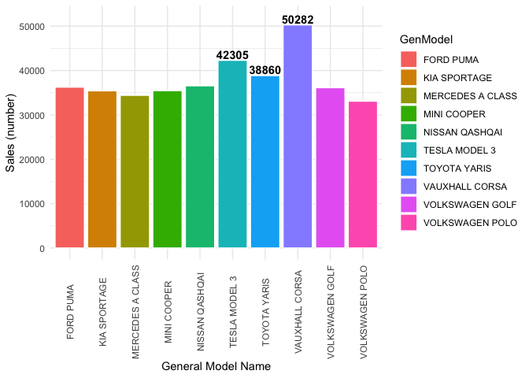
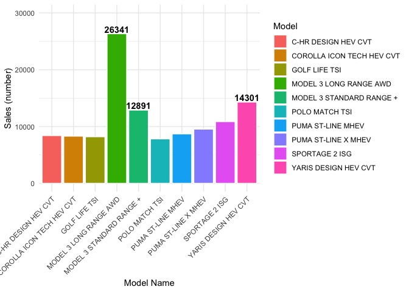
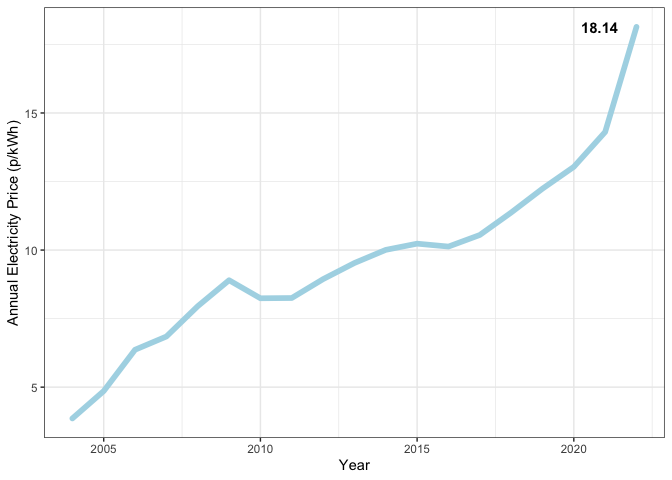
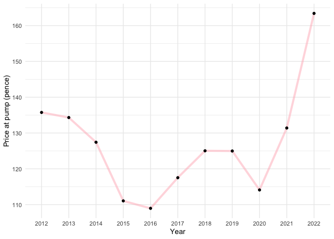
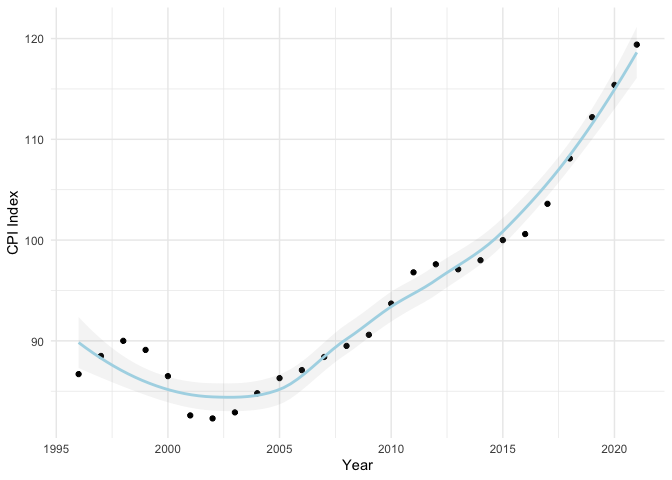

Google Capstone Project
================
2024-01-15

# Is it a good time to start a car sharing company in 2022?

## Background

A private investment would like to explore the opportunity of starting a
new car sharing/ rental company in the UK and compete with other
existing market holder such as ZipCar, Co-Wheel.

## Objective:

- What car body type should be in the fleet?
- What engine type of car should be considered?
- Is 2022 a good time?
- Potentially which city/ cities to launch if possible?

## Metric to use: Analyse data and find out:

- Popular UK car
- Cost to run and maintenance for different type of car
- City with highest hotel booking rate

## Data used:

- First time registered vehicle in the UK Office of National Statistics,
  Primary Data . For data [click
  here](https://www.gov.uk/government/statistical-data-sets/vehicle-licensing-statistics-data-tables)
- Consumer Price Index for new car Office of National Statistics,
  Primary Data. For data [click
  here](https://www.ons.gov.uk/economy/inflationandpriceindices/timeseries/cjxn/mm23)
- Non-domestic energy price Gov.UK, Primary Data. For data [click
  here](https://www.gov.uk/government/statistical-data-sets/gas-and-electricity-prices-in-the-non-domestic-sector)
- UK petrol price Gov.UK, Primary Data. For data [click
  here](https://www.gov.uk/government/statistical-data-sets/gas-and-electricity-prices-in-the-non-domestic-sector)

All data are downloaded and store locally in author desktop

## Analysis

RStudio is used to clean and analysis the result Tabule used to create
dashboard and data visualisation

- Total car sales in last 10 years
- Top 10 best-selling car general model in 2021-2022Q1
- Top 10 best-selling car specific model in 2021-2022Q1
- CPI index of new car
- UK Petrol and Electricity price

## Code

Install and load library

``` r
install.packages("tidyverse")
```

    ## 
    ## The downloaded binary packages are in
    ##  /var/folders/8z/lqbkxs9x4dq62txwlvwt29580000gn/T//RtmpZjMPiE/downloaded_packages

``` r
install.packages("zoo")
```

    ## 
    ## The downloaded binary packages are in
    ##  /var/folders/8z/lqbkxs9x4dq62txwlvwt29580000gn/T//RtmpZjMPiE/downloaded_packages

``` r
install.packages("ggplot2")
```

    ## 
    ## The downloaded binary packages are in
    ##  /var/folders/8z/lqbkxs9x4dq62txwlvwt29580000gn/T//RtmpZjMPiE/downloaded_packages

``` r
library(tidyverse)
```

    ## ── Attaching core tidyverse packages ──────────────────────── tidyverse 2.0.0 ──
    ## ✔ dplyr     1.1.4     ✔ readr     2.1.4
    ## ✔ forcats   1.0.0     ✔ stringr   1.5.1
    ## ✔ ggplot2   3.4.4     ✔ tibble    3.2.1
    ## ✔ lubridate 1.9.3     ✔ tidyr     1.3.0
    ## ✔ purrr     1.0.2     
    ## ── Conflicts ────────────────────────────────────────── tidyverse_conflicts() ──
    ## ✖ dplyr::filter() masks stats::filter()
    ## ✖ dplyr::lag()    masks stats::lag()
    ## ℹ Use the conflicted package (<http://conflicted.r-lib.org/>) to force all conflicts to become errors

``` r
library(zoo)
```

    ## 
    ## Attaching package: 'zoo'
    ## 
    ## The following objects are masked from 'package:base':
    ## 
    ##     as.Date, as.Date.numeric

``` r
library(ggplot2)
library(readxl)
```

tidyverse is used for data cleaning ggplot2 is used for plotting grpahs
Load data into RStudio

``` r
first_time_vehicle = read.csv("Dataset/First_time_register_vehicle.csv")
weekly_road_fuel_price = read.csv("Dataset/weekly_road_fuel_price.csv")
electric_price = read_xlsx("Dataset/table_341.xlsx", sheet =3, range = "A7:P80")
CPI_Data = read.csv("Dataset/New car CPI index.csv")
```

### Data cleaning for first time vehicle

``` r
##rename the column
first_time_vehicle = first_time_vehicle %>%
  rename_with(~ gsub('X', '', .x))

##Filter and select relavent data
filter_data = first_time_vehicle %>%
  select("BodyType":"2010Q4", -"2022Q1") %>%
  filter(BodyType == "Cars")

##Tranpose data as date in different columns which will be hard to group data by date
tranpose_data = filter_data %>%
  pivot_longer(
    cols = starts_with("20"), 
    names_to = "YrQr", 
    values_to = "Sales",
    values_drop_na = TRUE)
```

Find out overall car sales since 2011

``` r
Yr_only_sale = tranpose_data%>%
  mutate(Year_only = format(as.Date(as.yearqtr(tranpose_data$YrQr)), "%Y")) %>%
  group_by(Year_only) %>%
  summarise(Annual_total_car_sale= sum(Sales))
```

Find out the best selling car since 2011

``` r
car_Model_sale_from_2011 = tranpose_data %>%
  group_by(Make) %>%
  group_by(GenModel) %>%
  summarise(Total_model_sales_2021to2011 = sum (Sales)) %>%
  arrange(-Total_model_sales_2021to2011)

head(car_Model_sale_from_2011)
```

    ## # A tibble: 6 × 2
    ##   GenModel        Total_model_sales_2021to2011
    ##   <chr>                                  <int>
    ## 1 FORD FIESTA                          1057568
    ## 2 VAUXHALL CORSA                        752000
    ## 3 FORD FOCUS                            729382
    ## 4 VOLKSWAGEN GOLF                       702095
    ## 5 NISSAN QASHQAI                        534474
    ## 6 VAUXHALL ASTRA                        489507

Find out the best selling car from 2021 till 2022 in terms of General
Model.

``` r
filter_data_2021 = first_time_vehicle %>%
  select("BodyType":"2021Q1") %>%
  filter(BodyType == "Cars", !grepl("*MISSING", GenModel)) %>%
  mutate (Tota_sales = `2021Q1` + `2021Q2` + `2021Q3` + `2021Q4` + `2022Q1`, .keep = c("unused")) %>%
  group_by(GenModel) %>%
  summarise(Total_sales_by_genmodel = sum(Tota_sales)) %>%
  arrange(-Total_sales_by_genmodel)

head(filter_data_2021)
```

    ## # A tibble: 6 × 2
    ##   GenModel        Total_sales_by_genmodel
    ##   <chr>                             <int>
    ## 1 VAUXHALL CORSA                    50282
    ## 2 TESLA MODEL 3                     42305
    ## 3 TOYOTA YARIS                      38860
    ## 4 NISSAN QASHQAI                    36554
    ## 5 FORD PUMA                         36252
    ## 6 VOLKSWAGEN GOLF                   36128

Find out the best selling car from 2021 till 2022 in terms of Model.

``` r
Model_2021_22_sales = first_time_vehicle %>%
  select("BodyType":"2021Q1") %>%
  filter(BodyType == "Cars", !grepl("*MISSING", GenModel)) %>%
  mutate (Tota_sales = `2021Q1` + `2021Q2` + `2021Q3` + `2021Q4` + `2022Q1`, .keep = c("unused")) %>%
  group_by(Model) %>%
  #arrange(-Tota_sales)
  summarise(Total_sales_by_model = sum(Tota_sales)) %>%
  arrange(-Total_sales_by_model)

head(Model_2021_22_sales)
```

    ## # A tibble: 6 × 2
    ##   Model                    Total_sales_by_model
    ##   <chr>                                   <int>
    ## 1 MODEL 3 LONG RANGE AWD                  26341
    ## 2 YARIS DESIGN HEV CVT                    14301
    ## 3 MODEL 3 STANDARD RANGE +                12891
    ## 4 SPORTAGE 2 ISG                          10862
    ## 5 PUMA ST-LINE X MHEV                      9538
    ## 6 PUMA ST-LINE MHEV                        8704

Annual electric price

``` r
electric_price = electric_price %>%
  select(Year,Quarter,`Electricity: Average (Pence per kWh)`)%>%
  group_by(Year)%>%
  summarise(Annual_electricity = mean(`Electricity: Average (Pence per kWh)`))
```

CPI new car

``` r
CPI_Data = read.csv("Dataset/New car CPI index.csv")
CPI_Data = CPI_Data[8:33,]
CPI_Data_year = CPI_Data %>%
  rename(Year = Title,  CPI_Index = CPI.INDEX.07.1.1A...NEW.CARS.2015.100)
CPI_Data_year$CPI_Index =as.numeric( CPI_Data_year$CPI_Index)
CPI_Data_year$Year =as.numeric(CPI_Data_year$Year)

head(CPI_Data_year)
```

    ##    Year CPI_Index
    ## 8  1996      86.7
    ## 9  1997      88.5
    ## 10 1998      90.0
    ## 11 1999      89.1
    ## 12 2000      86.5
    ## 13 2001      82.6

Petrol pump price

``` r
colnames(weekly_road_fuel_price) = c (weekly_road_fuel_price[1:1,])
weekly_road_fuel_price$`Pump price in pence/litre` = as.numeric(weekly_road_fuel_price$`Pump price in pence/litre`)
```

    ## Warning: NAs introduced by coercion

``` r
filtered_fuel = weekly_road_fuel_price[1:2]
filtered_fuel = filtered_fuel[-c(1,2),]
rownames(filtered_fuel) <- NULL

filtered_fuel = filtered_fuel %>%
  mutate(Monthly_price = format(as.Date(filtered_fuel$`Weekly Prices time series`, "%d/%m/%Y"), "%Y")) %>%
  filter(Monthly_price >= 2012) %>%
  relocate(Monthly_price, .before = `Pump price in pence/litre`) %>%
  group_by(Monthly_price) %>%
  summarise(Pump_price = mean(`Pump price in pence/litre`))
head(filtered_fuel)
```

    ## # A tibble: 6 × 2
    ##   Monthly_price Pump_price
    ##   <chr>              <dbl>
    ## 1 2012                136.
    ## 2 2013                134.
    ## 3 2014                127.
    ## 4 2015                111.
    ## 5 2016                109.
    ## 6 2017                118.

## Plotting graph using ggplot2

Car sales

``` r
Yr_only_sale_1k=Yr_only_sale
Yr_only_sale_1k[,2]= Yr_only_sale_1k[,2]/1000
transform(Yr_only_sale_1k,Year_only= as.numeric(Year_only))
Yr_only_sale_1k$Year_only = as.numeric(Yr_only_sale_1k$Year_only)
```

``` r
annual_car_sale = ggplot(Yr_only_sale_1k) + 
  geom_line(mapping = aes(x=Year_only, y =(Annual_total_car_sale)), linetype = 1, color = "light blue", size =2, lineend = "round") +
  ylab("Annual Car Sales (thousands number)") + xlab("Year") +
  theme_bw() + theme(legend.title = element_blank())+
  geom_text(aes(label=ifelse(Year_only==2021, Annual_total_car_sale," "), x=Year_only, y =Annual_total_car_sale), hjust=0.5, vjust=1.5, fontface ="bold")
annual_car_sale
```

``` r
##by genmodel 
top_10_car = filter_data_2021 [1:10, ]
top_10_genmodel_2021 = ggplot(top_10_car, aes(x=GenModel, y=Total_sales_by_genmodel, fill =GenModel) )+
  geom_col( alpha =2, size =0.5, color = "white")+
  theme_minimal()+
  xlab("General Model Name") + ylab("Sales (number)")+
  theme(axis.text.x  = element_text(angle=90, vjust=0.6))+
  ylim(0,52000) +
  geom_text(aes(label=ifelse(GenModel=="VAUXHALL CORSA"|GenModel=="TESLA MODEL 3"| GenModel =="TOYOTA YARIS", Total_sales_by_genmodel,""), x=GenModel, y =Total_sales_by_genmodel), hjust=0.5, vjust=-0.2, fontface ="bold")
```

    ## Warning: Using `size` aesthetic for lines was deprecated in ggplot2 3.4.0.
    ## ℹ Please use `linewidth` instead.
    ## This warning is displayed once every 8 hours.
    ## Call `lifecycle::last_lifecycle_warnings()` to see where this warning was
    ## generated.

``` r
top_10_genmodel_2021
```

<!-- -->

``` r
##by model
top_10_model = Model_2021_22_sales [1:10, ]

First_model = top_10_model[1,1]
Second_model = top_10_model[2,1]
Third_model = top_10_model[3,1]

top_10_model_2021 = ggplot(top_10_model, aes(x=Model, y=Total_sales_by_model, fill =Model) )+
  geom_col( alpha =2, size =0.5, color = "white")+
  theme_minimal()+
  xlab("Model Name") + ylab("Sales (number)")+
  theme(axis.text.x  = element_text(angle=45, vjust=1, hjust = 1))+
  ylim(0,30000) +
  geom_text(aes(label=ifelse(Model %in% Second_model| Model %in% First_model|Model %in% Third_model, Total_sales_by_model," "), x=Model, y =Total_sales_by_model), hjust=0.5, vjust=-0.2, fontface ="bold")

top_10_model_2021
```

<!-- -->

Electricity

``` r
electric_graph = ggplot(electric_price) + 
  geom_line(mapping = aes(x=Year, y =Annual_electricity), linetype = 1, color = "light blue", size =2, lineend = "round") +
  ylab("Annual Electricity Price (p/kWh)") +
  theme_bw() + theme(legend.title = element_blank())+
  geom_text(aes(label=ifelse(Year==2022, Annual_electricity," "), x=Year, y =Annual_electricity), hjust=1.5, fontface ="bold")

electric_graph
```

<!-- -->

Petrol

``` r
petrol_graph= ggplot(filtered_fuel, aes(x=Monthly_price, y=Pump_price))+
  geom_line(group=1, size =1.5, color = "light pink", alpha =0.5)+
  geom_point()+
  theme_minimal()+
  ylab("Price at pump (pence)")+ xlab ("Year")

petrol_graph
```

<!-- -->

CPI

``` r
CPI_graph = ggplot(CPI_Data_year, aes(x=Year, y=CPI_Index))+
  geom_point()+
  geom_smooth(color = "light blue", alpha =0.1)+
  theme_minimal()+
  ylab("CPI Index")

CPI_graph
```

    ## `geom_smooth()` using method = 'loess' and formula = 'y ~ x'

<!-- -->

## Analysis/ Insight

#### Annual car sales

- There was a massive drop of annual car sales since 2020, likely due to
  COVID and post-COVID reduced production ability.
- Expecting to have the number back to 2018-19 level, about 500,000
  difference.
- Public are either driving old car or postpone buying their first car
- **Potential for car sharing company to offer them experience of
  driving new car**

### Best selling car model

- Difference between general model and specific model
- Corsa is the top selling general model but not in the top 10 specific
  model due to lots of difference sub-model under Corsa (e.g. petrol,
  diesel, electric)
- 6 out of 10 are hatchback, 3 are crossover SUV, 1 is medium SUV
- 2 is full electric, 5 are mild hybrid

### CPI index

- reach record high in last 20 years and expected to be remained high in
  the next year
- new car price will be high

### Electric and petrol price

- Both reach record high level since 2010
- Cost for running car will be high in the foreseeable future
- No correlation shown between fuel price and car sales

## Conclusion

The overall number of car sales is reduced in the last 2 years due to
logistic, manufacturing problems. The car price will likely remained
high in the near future. There is a potential to offer people with new
car experience. As the hatchback and small/crossover SUV are the most
popular car model in the market and electric and mild-hybrid cars are
also gaining momentum. These car type should be considered when setting
the fleet initially. The running cost of the fleet will also be high as
the fuel price remained record high. Thanks
